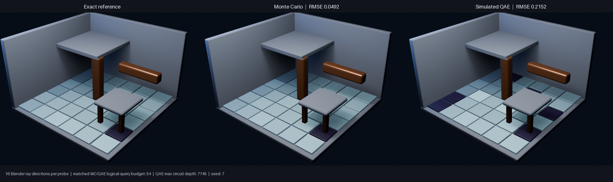

# Quantum-Assisted Ambient Occlusion in Blender

This is a small quantum-computation course project with one simple question:

> Can a quantum estimator help us approximate how open or enclosed a point in a 3D scene is?

Blender builds a little room and checks a handful of rays above each floor tile. The
project then estimates the fraction of open rays in three ways: exactly, with classical
Monte Carlo sampling, and with a simulated quantum amplitude-estimation circuit. Those
numbers directly colour the tiles in the final render.



## Run it

You need Blender 5.x and Conda. On macOS, Blender can be installed with Homebrew:

```bash
brew install --cask blender
conda env create --file environment.yml
conda activate quantum-blender-ao
./scripts/check.sh
./scripts/run_demo.sh
open generated/comparison.png
```

The environment is isolated from your other Python projects. If `environment.yml`
changes later, update it with:

```bash
conda env update --file environment.yml --prune
```

If Blender is not on your `PATH`, provide it explicitly:

```bash
BLENDER_BIN=/path/to/blender ./scripts/run_demo.sh
```

The command creates a scene, casts 16 directions per tile, runs the three estimators,
and writes the individual renders plus `generated/comparison.png`.

## What to look for

Bright tiles have many clear directions to the sky; dark tiles sit under the roof or near
other geometry. Exact is the reference. Monte Carlo and QAE are approximations, so their
tiles can be too bright or too dark.

With the included settings, Monte Carlo has an RMSE of `0.0492` against Exact, while the
simulated QAE result has an RMSE of `0.2152`. Both get the same 54 logical lookup-query
budget. That imperfect QAE image is useful: it makes the trade-off visible instead of
pretending that today's quantum tooling automatically improves graphics.

## What is in here

```text
blender/       scripts that create the room, cast rays, and render results
src/qbao/      exact, Monte Carlo, and simulated-QAE estimators
scripts/       one command to test, one command to run the demo
docs/          a short explanation for the course presentation
tests/         small checks for the estimator and image pipeline
```

For the maths, resource accounting, and honest limits of the experiment, read
[the course note](docs/course-note.md).

## One important limitation

This is not quantum ray tracing. Blender still does the geometric ray intersections
classically. The quantum circuit only estimates the mean of the resulting open/blocked
table. The project is about a clear, visual comparison of estimators—not a claim that a
simulated QPU renders Blender faster.
