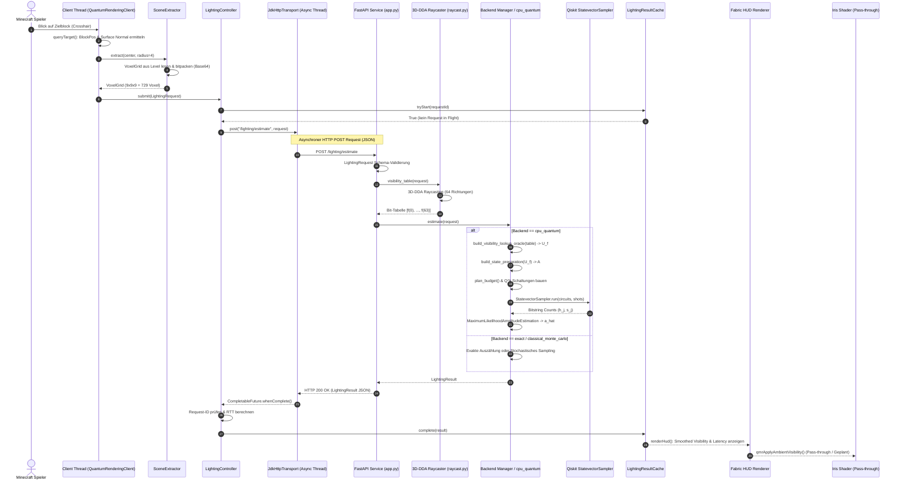

# 10 - End-to-End-Walkthrough

Diese Datei beschreibt den vollständigen Lebenszyklus eines Anforderungs- und Berechnungsdurchlaufs im Projekt `quantum-minecraft-rendering` — von dem Moment, in dem ein Spieler in Minecraft einen Block anvisiert, über die Voxel-Extraktion, die asynchrone HTTP-Übertragung, das klassische 3D-DDA-Raycasting, die Quantenschaltungssynthese und Simulation im Python-Service bis hin zur Rückgabe, HUD-Anzeige und Shader-Aufbereitung.

---

## 1. Übersicht des Datenflusses und Mermaid-Sequenzdiagramm

Das folgende Diagramm stellt das zeitliche Zusammenspiel aller Klassen, Threads und Dienste vom Minecraft-Client bis zum Quanten-Backend dar.

---

## 2. Der 17-Schritte End-to-End-Ablauf

| Schritt | Bezeichnung | Beteiligte Datei | Klasse / Funktion | Zeilen | Eingabedaten | Ausgabedaten | Mögliche Fehler | Thread / Prozess |
| :---: | :--- | :--- | :--- | :--- | :--- | :--- | :--- | :--- |
| **1** | Block-Anvisierung | `QuantumRenderingClient.java` | `queryTarget()` | 148–170 | Blickrichtung des Spielers | Hit-Resultat (`BlockHitResult`) | Kein Block anvisiert (`hitResult == null`) | Minecraft Client Thread |
| **2** | Positions- & Normalenberechnung | `QuantumRenderingClient.java` | `queryTarget()` | 151–162 | `BlockHitResult` | World Position, Surface Normal Vector | Ziel außerhalb der Reichweite | Minecraft Client Thread |
| **3** | Voxel-Volumen Extraktion | `SceneExtractor.java` | `extract()` | 10–50 | World Pos, Radius=4, `VoxelSampler` | `CompactVoxelGrid` ($9\times9\times9$) | Chunk nicht geladen (`hasChunk == false`) | Minecraft Client Thread |
| **4** | Request-Erzeugung & Bitpacking | `RequestFactory.java`, `CompactVoxelGrid.java` | `create()`, `toPayload()` | 26–45 (Factory), 98–109 (Voxel) | `CompactVoxelGrid`, Config | `LightingRequest` (JSON) | Ungültige Dimensionen | Minecraft Client Thread |
| **5** | Asynchroner HTTP-POST | `JdkHttpTransport.java`, `LightingServiceClient.java` | `post()`, `estimate()` | 10–41 (Transport), 14–53 (Client) | `LightingRequest`, Service-URL | `CompletableFuture<LightingResult>` | Timeout ($>2000\text{ ms}$), Verbindung abgelehnt | Netty / Async HTTP Thread Pool |
| **6** | Service-Empfang & Validierung | `api.py`, `models.py` | `estimate_lighting()`, `LightingRequest` | 92–166 (`api.py`), 98–138 (`models.py`) | HTTP-Request Body | Validiertes `LightingRequest`-Objekt | HTTP 422 Unprocessable Entity (Schemaverstoß) | FastAPI / Uvicorn Worker Thread |
| **7** | 3D-DDA-Raycasting | `raycast.py`, `directions.py` | `visibility_table()`, `reaches_sky()` | 12–58 (`raycast.py`), 17–48 (`directions.py`) | VoxelGrid, Position, Normale, $N=64$ | Boolesche Tabelle $[f(0), \dots, f(N-1)]$ | Ray überschreitet `max_distance` | Python Service Thread |
| **8** | Pfad A: Exakte Auszählung (`exact`) | `exact.py` | `ExactBackend.estimate()` | 12–45 | Boolesche Tabelle | $a_{\text{exact}} = \frac{1}{N}\sum f(i)$ | Keine (Deterministisch) | Python Service Thread |
| **9** | Pfad B: Monte Carlo (`monte_carlo`) | `monte_carlo.py` | `ClassicalMonteCarloBackend.estimate()` | 38–87 | Boolesche Tabelle, Seed, Budget $M$ | $\hat{a}_{\text{MC}}$, Wilson CI | Seed-Initialisierungsfehler | Python Service Thread |
| **10** | Pfad C: Quantenschaltungssynthese (`cpu_quantum`) | `cpu_quantum.py` | `build_visibility_operators()`, `plan_budget()` | 141–200, 112–131 | Boolesche Tabelle, Budget $M$ | Operatoren $A, U_f, S_{\text{good}}, Q$ & Potenzen $Q^k$ | Speicherüberschreitung bei großem $N$ | Python Service Thread |
| **11** | Pfad C: Finite-Shot Simulation (`cpu_quantum`) | `cpu_quantum.py` | `StatevectorSampler.run()` | 256–285 | $Q^k$-Schaltungen, Shots $s$ | Bitstring-Messzählungen $h_j$ | Qiskit Simulation Error | Python Service Thread |
| **12** | Pfad C: Maximum-Likelihood Schätzung (`cpu_quantum`) | `cpu_quantum.py` | `MaximumLikelihoodAmplitudeEstimation` | 289–304 | Messzählungen $h_j$, Schedule $K$ | Geschätzter Wert $\hat{a}_{\text{MLAE}}$, Likelihood CI | Nicht-Konvergenz der Num-Optimierung | Python Service Thread |
| **13** | Resultat-Erzeugung & Response | `base.py`, `models.py` | `result_for()`, `LightingResult` | 80–110 (`base.py`), 152–175 (`models.py`) | Schätzwert, Timing, Gatterzahlen | HTTP 200 OK (`LightingResult` JSON) | JSON-Serialisierungsfehler | FastAPI / Uvicorn Worker Thread |
| **14** | Client-Empfang & Request-ID Prüfen | `LightingServiceClient.java` | `parseResponse()` | 42–45 | HTTP 200 JSON Body | Validierter `LightingResult` | Mismatched Request-ID (verworfen) | Async HTTP Response Thread |
| **15** | Cache & Glättung | `LightingResultCache.java`, `VisibilitySmoother.java` | `complete()`, `update()` | 8–70 (`Cache`), 4–36 (`Smoother`) | `LightingResult`, Delta Time $\Delta t$ | Exponentiell geglätteter Wert $\tilde{a}$ | Race Condition (verhindert durch `synchronized`) | Client Main / Render Thread |
| **16** | HUD-Rendering | `QuantumRenderingClient.java` | `renderHud()` | 192–216 | Geglätteter Wert $\tilde{a}$, Backend-Metrics | Text-Overlay auf Bildschirm | GUI-Graphics Matrix-Exception | Minecraft Render Thread |
| **17** | Shader-Einbindung (Pass-through) | `composite.fsh`, `qmr_visibility.glsl` | `qmrApplyAmbientVisibility()` | 13–15 (`composite.fsh`), 4–8 (`qmr_visibility.glsl`) | Base Color, `qmrManualVisibility` | Final Fragment Color | Keine (Pass-through No-op) | GPU Fragment Shader Exec |

---

## 3. Detaillierte Schrittbeschreibungen

### Schritte 1–4: Clientseitige Erfassung und Voxel-Extraktion
1. **Schritt 1 & 2:** Wenn der Spieler in die Welt blickt, führt `QuantumRenderingClient.queryTarget()` (`QuantumRenderingClient.java`, Zeilen 148–170) eine Raycast-Abfrage über Minecrafts `minecraft.hitResult` durch. Sobald ein solide Block getroffen wird (`BlockHitResult`), wird dessen exakte Blockposition `BlockPos` und die anvisierte Seiten-Normale (z. B. $(0, 1, 0)$ für die Oberseite) ausgelesen.
2. **Schritt 3:** Der `SceneExtractor` (`SceneExtractor.java`, Zeilen 10–50) zentriert eine $9 \times 9 \times 9$ Voxel-Bounding-Box um den Zielblock (Radius $r=4$). Bevor Daten gelesen werden, prüft `ChunkFootprint.allChunksLoaded()` (`ChunkFootprint.java`, Zeilen 12–32), ob alle Chunks im Abdeckungsbereich geladen sind. Bei fehlenden Chunks wird die Extraktion sofort abgebrochen, um fehlerhafte Luft-Voxel zu vermeiden.
3. **Schritt 4:** Der extrahierte Voxel-Block wird in ein `CompactVoxelGrid` umgewandelt (`CompactVoxelGrid.java`, Zeilen 35–48) und über die Formel $\text{index}(x,y,z) = x + dx \cdot y + dx \cdot dy \cdot z$ in drei Bitsets (`solid`, `transparent`, `emissive`) serialisiert und Base64-codiert. `RequestFactory.create()` (`RequestFactory.java`, Zeile 26) versieht den Request mit einer eindeutigen UUID `request_id`.

### Schritte 5–7: Asynchroner Transport & 3D-DDA-Raycasting
4. **Schritt 5:** `LightingServiceClient.estimate()` (`LightingServiceClient.java`, Zeilen 14–53) übergibt den Request an den `JdkHttpTransport` (`JdkHttpTransport.java`, Zeilen 10–41). Der HTTP-POST an `http://127.0.0.1:8080/lighting/estimate` erfolgt asynchron über Javas `HttpClient.sendAsync()`, wodurch der Render-Thread von Minecraft zu $100\%$ blockierungsfrei bleibt.
5. **Schritt 6 & 7:** Der Python-FastAPI-Service empfängt den Request in `api.py` (Zeilen 92–166). Nach Schema-Validierung startet `raycast.py` (`raycast.py`, Zeilen 12–60). Über eine Fibonacci-Gitter-Verteilung (`directions.py`, Zeilen 17–48) werden $N=64$ Richtungsvektoren auf der Halbkugel generiert. Der 3D-DDA-Raycaster schießt für jede Richtung einen Strahl durch das Voxel-Gitter und erzeugt eine 64-Bit-Visibility-Tabelle $f(i) \in \{0, 1\}$.

### Schritte 8–13: Backend-Berechnung und Resultaterzeugung
6. **Schritte 8–12:** Je nach gewähltem Backend verarbeitet der Service die Tabelle:
   - Bei `exact`: Direkte Aufsummierung $a = \frac{1}{64}\sum f(i)$ in $0.00025\text{ ms}$.
   - Bei `classical_monte_carlo`: $M$ Stichproben mit Zurücklegen und Wilson-Score-CI.
   - Bei `cpu_quantum`: Das Reversible Oracle $U_f$ wird synthetisiert (`cpu_quantum.py`, Zeilen 141–161). Der Grover-Operator $Q$ wird gebaut und Schaltungen für Potenzen $k \in \{0, 1, 2, 4, 8\}$ werden an Qiskits `StatevectorSampler` übergeben. Aus den gemessenen Bitstrings schätzt ein Likelihood-Optimizer den Wert $\hat{a}$.
7. **Schritt 13:** Das Ergebnis wird in ein `LightingResult`-Objekt verpackt (`base.py`, Zeile 80), das Schätzwert, Konfidenzintervalle, Laufzeiten und Quantenressourcen-Kennzahlen enthält.

### Schritte 14–17: Client-Verarbeitung, HUD und Shader
8. **Schritte 14 & 15:** Der HTTP-Callback im Fabric-Mod empfängt die JSON-Antwort (`LightingServiceClient.java`, Zeile 42). Stimmt die `request_id` mit dem in-flight gestarteten Request überein, wird das Ergebnis im `LightingResultCache` (`LightingResultCache.java`, Zeilen 8–70) abgelegt. Der `VisibilitySmoother` (`VisibilitySmoother.java`, Zeilen 4–36) glättet den Wert zeitlich über $\alpha = 1.0 - e^{-\Delta t / 0.25}$, um abrufte Verhaltungsänderungen abzufedern.
9. **Schritt 16 & 17:** Der HUD-Renderer (`QuantumRenderingClient.java`, Zeilen 192–216) zeichnet den geglätteten Sichtbarkeitswert sowie Latenzen direkt auf das Gui-Overlay.

> **Status-Hinweis zum Shader (Schritt 17):**
> Diese Komponente wurde nur statisch geprüft beziehungsweise kompiliert und noch nicht im laufenden Zielsystem validiert.
> Das Shaderpack unter `shaderpack/shaders/` stellt ein statisches Pass-through-Gerüst dar. Es existiert keine dynamische Uniform-Brücke von Java zu Iris, weshalb der Sichtbarkeitswert aktuell nur im HUD dargestellt wird.
